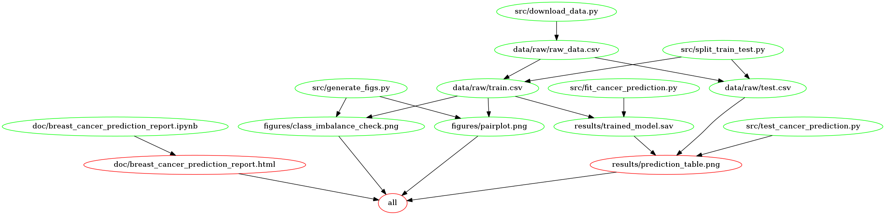

# Breast Cancer Predictor Using Clinical and Anthropometric Data.

This is the repo for the group project for DSCI 522 (group 16)

- Author: DSCI 522 GROUP 16
- Contributors: Aditya, Ifeanyi Anene, Rahul Kuriyedath, Saule Atymtayeva

A data analysis project for DSCI 522; a course in the Master of Data Science program at the University of British Columbia.

# About 
At the current stage of this project, we are trying to answer the predictive question: given clinical and anthropometric data and parameters available, predict if a patient has breast cancer or not? Answering this question is important because breast cancer is the most common malignancy amongst women worldwide (Crisóstomo et al., 2016) and developing a prediction model that can act as a biomarker for breast cancer will help mitigate the mortality rate of patients.


The dataset used in this project consists of anthropometric (i.e relating to the measurements of the human body e.g weight, height etc) data and parameters gathered in a standard blood analysis. This dataset was created by Miguel Patrício, José Pereira, Joana Crisóstomo, Paulo Matafome, Raquel Seiça, Francisco Caramelo, all from the Faculty of Medicine of the University of Coimbra and also Manuel Gomes from the University Hospital Centre of Coimbra (Patrício et al., 2018). The dataset was sourced from the UCI Machine Learning Repository (Dua and Graff 2017) and it can be found [here](https://archive.ics.uci.edu/ml/datasets/Breast+Cancer+Coimbra), particularly [this file](https://archive.ics.uci.edu/ml/machine-learning-databases/00451/dataR2.csv). Each row in this dataset represents a set of observations of individual patients and each column represents a variable. In this dataset, there are 116 observations and 9 features which are all numerical. The features include: Age (years), which is the amount of time the patient has lived; BMI (kg/m2), the Body mass index, is a measure of body fat based on height and weight of the patient; Glucose (mg/dL), which is blood sugar level of the patient; Insulin (µU/mL), is the amount of insulin in your blood, whereby insulin is a hormone that helps transport glucose, from the bloodstream into the cells; HOMA, this estimates the steady state beta cell function (%B) and insulin sensitivity (%S) (HOMA2 Calculator : Overview, 2020); Leptin (ng/mL), which is a hormone that helps with regulating the energy balance by inhibiting hunger, which thereby decreases the fat storage in adipocytes; Adiponectin (µg/mL), which is a protein hormone that is concerned with regulating glucose levels along with fatty acid breakdown; Resistin (ng/mL), which increases the production of low-density lipoprotein (LDL) in the patient's liver cell and weakens the LDL receptors in the liver; MCP-1 (pg/dL), which is a crucial chemokines that regulates migration and infiltration of monocytes/macrophages (Deshmane et al., 2009). There are zero observations with missing values for each class in the dataset. The target column is a binary dependent variable, which indicates the presence (Classification = 2) or absence (Classification = 1) of breast cancer.


To avoid breaking the golden rule, we separated the data set into a train and test set (splitting on 80:20) and then an exploratory data analysis was undertaken to assess the features that might be important for prediction. The exploratory data analysis includes plots that elucidates the importance of features such as (Glucose, Insulin, HOMA, and Resistin).


Furthermore, given that there are only numerical features in this dataset, the features were scaled using the standard scaler function during data preprocessing. Subsequently, multiple machine learning classifiers were explored based on multiple classification evaluation metrics such as recall, f1, precision and accuracy scores. The baseline model was created using sklearn's DummyClassifier. This classifier was included as a sanity check to use in comparison with the other, more complicated classifiers.  Furthermore, these more complicated classifiers were explored, and then the `Logistic Regression` classifier was chosen based on the most important evaluation metric, `recall`.
  

A literate code document of the current analysis undertaken can be found [here](doc/breast_cancer_prediction_report.ipynb).


# Usage
To replicate the analysis, clone this GitHub repository, install the [dependencies](#dependencies) listed below, and run the following commands at the command line/terminal from the root directory of this project:

- Create a conda envrioment using the `group16.yml`

```bash
conda env create -f group16.yml
conda activate group16
```

## With Docker 

- To run this analysis using Docker, clone/download this repository, use the command line to navigate to the root of this project on your computer, and then type the following (filling in PATH_ON_YOUR_COMPUTER with the absolute path to the root of this project on your computer).

```
docker run --rm -v PATH_ON_YOUR_COMPUTER:/home/data_analysis_eg ifyanene/dsci522-group16:v0.3.0 make -C ‘/home/data_analysis_eg’ all
```

To clean up the analysis type:

```
docker run --rm -v PATH_ON_YOUR_COMPUTER:/home/data_analysis_eg ifyanene/dsci522-group16:v0.3.0 make -C ‘/home/data_analysis_eg’ clean
```

## Without Docker

- To run this analysis without using Docker, install the dependencies [here](https://github.com/UBC-MDS/dsci522-group16/blob/main/group16.yml). 

Once the dependencies are installed 

Use makefile to run the analysis by running the below command in terminal from the root directory of this project:

```
make all
```

To reset the repo to it's initial state, run the following command at the command line from the root directory of this project:

```
make clean
```

## Makefile Dependency Graph



# Dependencies

To run this project, please install the required dependencies [here](https://github.com/UBC-MDS/dsci522-group16/blob/main/group16.yml)


# License 

The Breast Cancer Predictor Using Anthropometric data materials are licensed under the Creative Commons Attribution 2.5 Canada License (CC BY 2.5 CA). If re-using/re-mixing please provide attribution and link to this webpage.


# References 

Patrício, M., Pereira, J., Crisóstomo, J., Matafome, P., Gomes, M., Seiça, R. and Caramelo, F., 2018. Using Resistin, glucose, age and BMI to predict the presence of breast cancer. BMC Cancer, 18(1). https://doi.org/10.1186/s12885-017-3877-1

Dua, Dheeru, and Casey Graff. 2017. “UCI Machine Learning Repository.” University of California, Irvine, School of Information; Computer Sciences. http://archive.ics.uci.edu/ml.

Crisóstomo, J., Matafome, P., Santos-Silva, D., Gomes, A., Gomes, M., Patrício, M., Letra, L., Sarmento-Ribeiro, A., Santos, L. and Seiça, R., 2016. Hyperresistinemia and metabolic dysregulation: a risky crosstalk in obese breast cancer. Endocrine, 53(2), pp.433-442.


Deshmane, S.L., Kremlev, S., Amini, S. and Sawaya, B.E., 2009. Monocyte chemoattractant protein-1 (MCP-1): an overview. Journal of interferon & cytokine research, 29(6), pp.313-326.

Dtu.ox.ac.uk. 2020. HOMA2 Calculator : Overview. [online] Available at: <https://www.dtu.ox.ac.uk/homacalculator/> [Accessed 29 November 2020].
